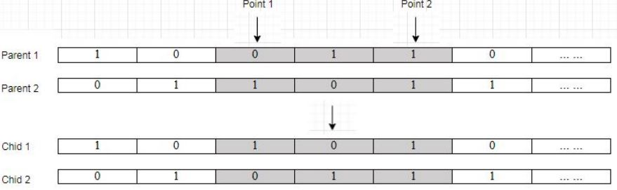
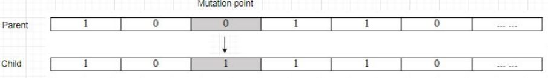
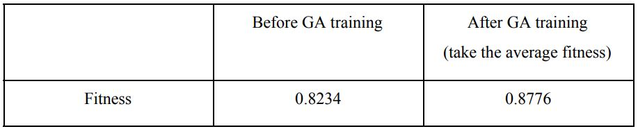

# Feature-Selection-By-Using-GA-In-NN
## Evolutional Computing Project
## Description
As there may have some dataset with too many attributes related, some is useful but actually most of them is useless in predicting the result/label. Hence, this project is to apply feature selection to filter out the usefull attributes in predicting by using Genetic Algorithm in Evolutional Computing concept 

## Process Detail
### Parent Selection
Tournament Selection is used in the parent selection process. 2 random individuals will be selected from the population, the one with higher fitness will be kept to be a parent. This process will be repeated to select the second parent and it will stop if the two selected parents are not from the same position (it is possible that a chromosome appears multiple times in the same generation).  

### Crossover
Crossover function is working as a convergence operation to pull the population towards a better performance by extracting the useful genes. The way of getting the new
chromosome is by recombination where we use 2-point crossover. 2 random points will be
selected and cut to do crossing between 2 parents to form 2 new children.  

### Mutation
The mutation function is working as a  divergence operation to explore more possible solutions. As the gene is in binary form, Bit Flip Mutation is selected to be used in GA training. After the  mutation,the genes will be inverted from before(0 to 1 or 1 to 0).  

### Survival Selection
The selected survival method is Age-based method, all the chromosomes in previous generation will be replaced by their children. After the competition in parent selection and updated by crossover & mutation, these 2 children will replace their parents to be part of the new generation. The processes from parent selection until survival selection will repeat 5 times to generate 10 new children ready for next generation. As the probability of crossover and mutation is not high, some of the children may be same as their parents.  

### Termination strategy
The GA training will be terminated under 2 conditions:
- Completed 30 generations  
- The fitness reaches 1.0 (100% accuracy with only 1 selected attributes) In most of the conditions, the fitness is impossible to reach 1.0, hence it can be considered that the training will only be terminated after 30 generations.  
- 
## Preview Image
Training result before filter attributes:  

Training result after filter attributes:  

Comparing result:  

